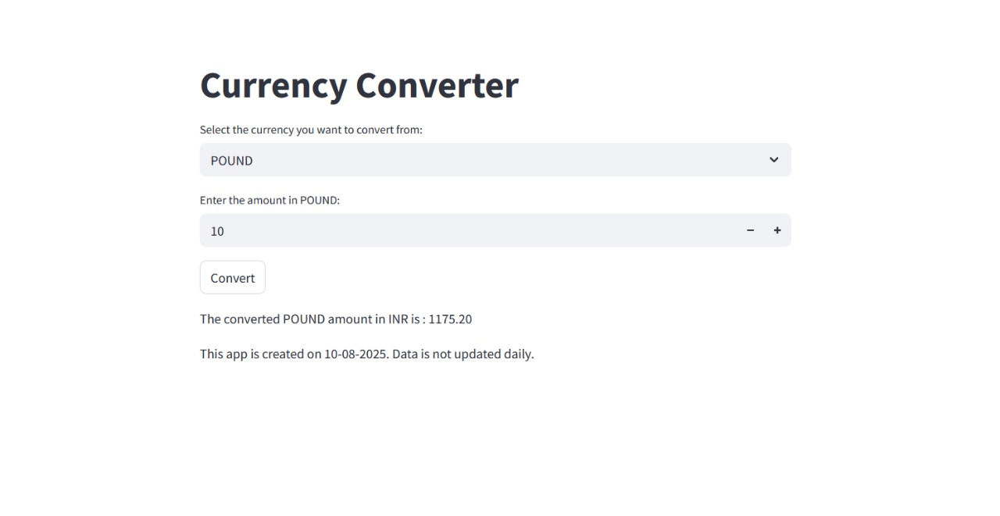
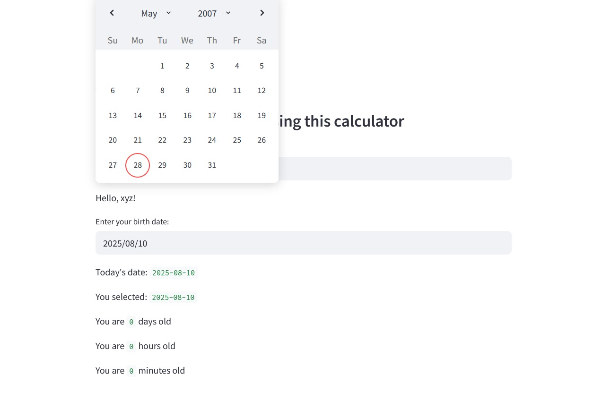
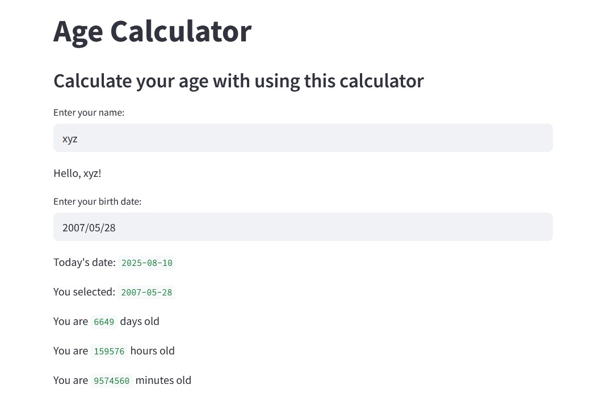

# 🚀 Python Framework Mini Projects

Welcome to **Python Framework Projects** 🎯 — a collection of small but powerful Python applications built with **Streamlit**.  
These apps are interactive, beginner-friendly, and perfect to understand real-world Python concepts in action.  

---

## 🌟 Projects Showcase

### 💱 Currency Converter  
Convert popular world currencies into **Indian Rupees (INR)** instantly!  
✅ Choose your currency  
✅ Enter the amount  
✅ Get the INR value in seconds  

**📸 Screenshot:**  


---

### 🎂 Age Calculator (With Date Picker)  
Ever wondered exactly **how old** you are in days, hours, or even minutes? ⏳  
Just enter your name, select your birth date, and boom 💥 — your exact age appears!  

**📸 Screenshot:**  


---

### 📅 Age Calculator (Direct Date Input)  
For speed lovers 🏎️ — type your birth date in `YYYY/MM/DD` format and instantly see your age details!  

**📸 Screenshot:**  


---

## ⚙️ How to Install & Run

```bash
# Clone this repository
git clone https://github.com/DarshanAjudiya7/python-framework.git

# Move into project folder
cd python-framework

# Install required dependencies
pip install -r requirements.txt

# Run the app
streamlit run app.py
````

---

## ❤️ Made With

* 🐍 **Python**
* 🎨 **Streamlit**
* 💡 **Creativity & Fun**


